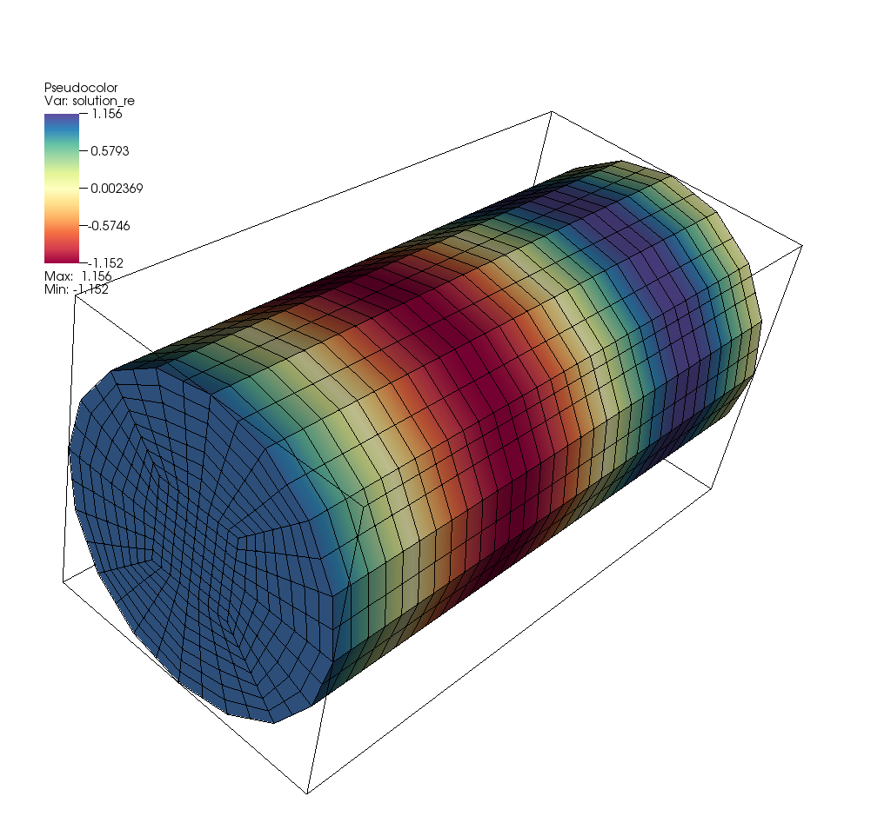
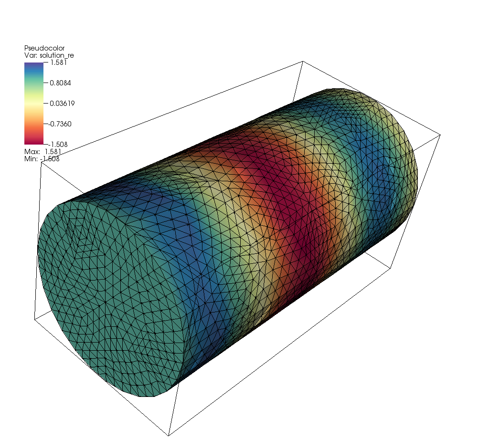
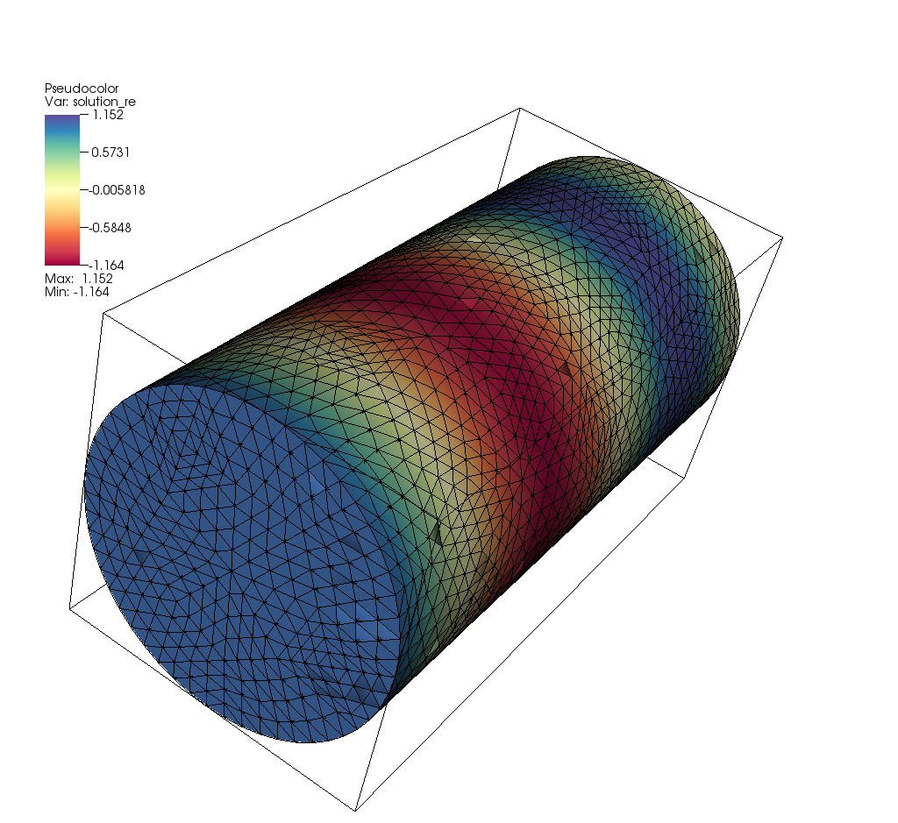

# Overview

The executable program of this project solves the equations that describe
the acoustic response of a cavity to an applied pressure at one of a
number of ports. It then outputs the average pressure and average
(volumetric) velocity at all ports.

For a given frequency omega, the equations to be solved are the
Helmholtz equations and read
```
  -omega^2 p(x,y,z) - c^2 p(x,y,z) = 0
```
where `c` is the (possibly complex-valued) wave speed and `p` is the
pressure field we seek. The boundary conditions applied to this
equation are
```
  p = 1
```
at a "source port" and
```
  p = 0
```
at all other ports. For the remainder of the boundary, the boundary
conditions applied are
```
  n . nabla p = 0
```

The program solves these equations for a range of frequencies `omega` to compute
a frequency-dependent response of the cavity.

The underlying method used for the solution of the equation is the finite element
method (FEM).


# Input

The program reads the parameter values that determine what is to be
computed from an input file. If the executable is called without
arguments, then the input file is implicitly assumed to be a
file called `helmholtz.prm`, located in the directory in which the
executable is run. In that case, output is also written into this
directory. On the other hand, if the executable is called with a
command line argument, then this argument is interpreted as the name
of a directory in which the input file `helmholtz.prm` is located,
and to which the output files are to be written.


The syntax of the `helmholtz.prm` file is as follows (the values shown
here on the right hand side of the assignment of course need to be
replaced by values appropriate to a simulation):
```
set Mesh file name                       = ./mesh.msh
set Geometry conversion factor to meters = 0.001
set Evaluation points                    = -25,15,1 ; -25,15,2

set Wave speed                           = 343
set Wave speed loss tangent              = 2
set Density                              = 1.18

set Frequencies                          = list(5000,10000,15000)
set Number of mesh refinement steps      = 0
set Finite element polynomial degree     = 2
set Number of threads                    = 1
```
The first of these parameters, obviously, corresponds to the name of a
file that contains the mesh (in the "msh" format generated by the gmsh
program) that describes the domain on which to solve the PDE (i.e., the shape
of the cavity). The second parameter in this block describes a scaling
factor: mesh files generally are drawn up in community-specific units
(millimeters, inches) whereas this program internally works with SI
units (i.e., kilograms, meters, seconds) and the parameter describes
the scaling from length units used in the mesh file to meters. In the
example above, this corresponds to the mesh file using millimeters.
The third parameter describes a list of three-dimensional points
(using the same units as the mesh file) at which the pressure and
volumetric velocity will be evaluated for each frequency. Points are
separated by semicolons, and the components of the points are
separated by commas.

The second block describes the mechanical properties of the
membrane. All parameters are given in SI units. `Wave speed loss
tangent` is
dimensionless (or, more precisely, has the units of a geometric angle)
and is interpreted in degrees.

The third block describes the frequencies that should be
computed. There are three possibilities for this parameter:

  - Specify `linear_spacing(f1,f2,nsteps)`: This computes `nsteps`
    frequencies between `f1` and `f2` (given in Hz) with equal spacing
    between frequencies.
  - Specify `exp_spacing(f1,f2,nsteps)`: This computes `nsteps`
    frequencies between `f1` and `f2` (given in Hz) with equal spacing
    between the logarithms of frequencies. In other words, the gaps
    between successive frequencies grow exponentially: On a log plot,
    the frequencies so computes are equall spaced.
  - Specify `list(f1,f2,f3,...)`: Here, the program computes all of
    the frequencies explicitly listed between parentheses. The list
    may have any length, as long as it contains at least one element.

The fourth block of parameters shown above describes properties of the
discretization, i.e., of _how_ the problem (formulated as a PDE)
should be solved rather than what the problem actually is. In
particular, the parameters list the number of mesh refinement steps
(each refinement step replaces each cell of the mesh by its four
children) as well as the polynomial degree of the finite element
approximation.

The number of mesh refinement steps is interpreted in the following
way: If it is positive or zero, then the mesh on which the solution is
computed is simply the mesh taken from the file listed in the first
parameter, this many times refined by replacing each cell by its four
children in each refinement step. In particular, this leads to using
the same mesh for all frequencies.

On the other hand, if the number of mesh refinement steps is negative,
then the mesh is adapted using the following algorithm. For a given
wave speed, we can compute the wavelength of oscillations for a
given frequency _w_ via
```
  lambda = c/f
         = c/(w/(2pi))
```
If `lambda` is larger than the diameter of the domain, then we replace
it by the diameter of the domain since that is the largest wavelength
at which the solution can vary.
We can then determine a frequency-adapted mesh size in the following
way: We want that there are at least _N_ grid points per wave
length. Since there are as many grid points per cell as the polynomial
degree _p_, this equations to requiring that the mesh size _Delta x_
satisfies _Delta x / p <= lambda/N_
or equivalently: _Delta x <= lambda/N * p_. The `Mesh refinement steps`
parameter is then interpreted as _N_ if it is negative.

The last parameter, `Number of threads`, indicates how many threads
the program may use at any given time. Threads are used to compute
the frequency response for different frequencies at the same time
since these are independent computations. A value of zero means that
the program may use as many threads as it pleases, whereas a positive
number limits how many threads (and consequently CPU cores) the
program will use.


# Output

The output of the program consists of three pieces:
- the frequency response file in human-readable form
- the frequency response file in machine-readable form
- and a number of files in the visualization directory.

### The file `frequency_response.txt`

*TODO:* Update with the exact contents of these files once known.


### The file `frequency_response.csv`

*TODO:* Update with the exact contents of these files once known.


### Monitoring progress

The `frequency_response.txt` and `frequency_response.csv` files are
updated every time the program has finished computing the response of
the membrane for a particular frequency. As a consequence, the file
contains a record of all computed frequencies.

To monitor the progress of computations -- for example for displaying
a progress bar -- open the `frequency_response.csv` file periodically
(say, once a second) and read what's in it. If all you want is to show
progress: The first line of the file has a format that, during
computations, says something like "`# 42/100 frequencies computed`",
allowing for a quick overview where computations currently are. If you
want something fancier, you can actually parse the contents of the
file and update a graph of the frequency-dependent membrane response
every time you read through the file. This way, the graph will fill in
over time.

*TODO:* Update with the exact contents of these files once known.


### The directory `visualization/`

This directory contains one file for each input frequency and source port, with each file providing
all of the information necessary to visualize the solution. The format used for these
files is VTU, and the solution can be visualized with either the
[Visit](https://wci.llnl.gov/simulation/computer-codes/visit) or
[Paraview](https://www.paraview.org/) programs.
The file names are of the form `visualization/solution-XXXXX.YY.vtu` where `XXXXX`
denotes the (integer part of the) frequency (in Hz) at which the solution
is computed, and `YY` is the number of the source port.


# Terminating execution

There may be times where callers of this program do not want it to continue with
its computations. In this case, an external program should place the text `STOP`
into a file called `termination_signal` in the current directory. This
will terminate the program. That said, because the program outputs all
data already computed whenever one frequency is finished, even when a
program execution is terminated, already computed information is still
stored in the output files.

The program works on input frequencies in an unpredictable order, since work
for each frequency is scheduled with the operating system at the beginning
of program execution, but it is the operating system's job to allocate CPU
time for each of these tasks. This is often done in an unpredictable order.
As a consequence, the frequencies already worked on at the time of termination
may or may not be those listed first in the input file.


# How this program was tested

We can check for the correctness of the program using the following
set up:

The mesh is a cylinder along the _x_-axis with length 4 and radius
1. We use a scaling factor of 0.001, so this corresponds to a length
_L_=4mm and radius _r_=1mm.

The solution to this problem is one-dimensional, and reads
```
  p(x) = a*exp(j*k*x) + b*exp(-j*k*x)
```
with _k=omega/c_ and _a,b_ so that
```
  p(0) = 1
  p(L) = 0
```
which implies
```
  a+b=1
  a*exp(j*omega/c*L) + b*exp(-j*omega/c*L)=0
```
Inserting the first of these equations into the second, and multiplying by
`exp(j*omega/c*L)`, we get
```
  (1-b)*exp(2*j*omega/c*L) + b=0
```
which implies
```
  exp(2*j*omega/c*L) + (1-exp(2*j*omega/c*L))*b=0
```
and consequently
```
  b = -exp(2*j*omega/c*L) / [ 1-exp(2*j*omega/c*L) ]
  a = (1-b)
    = 1+exp(2*j*omega/c*L) / [ 1-exp(2*j*omega/c*L) ]
    = 1 / [ 1-exp(2*j*omega/c*L) ]
```
Taken together, this results in the following solution:
```
  p(x) = exp(j*omega/c*x)/[ 1-exp(2*j*omega/c*L) ]
         - exp(2*j*omega/c*L) * exp(-j*omega/c*x)/[ 1-exp(2*j*omega/c*L) ]
       = [ exp(j*omega/c*x) - exp(j*omega/c*(2L-x)) ]
           / [ 1-exp(2*j*omega/c*L) ]
```
We can easily verify that `p(0)=1` and `p(L)=0`, as expected.

Furthermore, we can compute the (volumetric) velocity as
```
  u(x) = -1/(j rho omega) nabla p
```
of which only the _x_-component is nonzero and reads as
```
  u_x(x) = -1/(rho c) [ exp(j*omega/c*x) + exp(j*omega/c*(2L-x)) ]
           / [ 1-exp(2*j*omega/c*L) ]
```
So, at the left end of the cylinder, we have
```
  u_x(0) = -1/(rho c) [ 1 + exp(2*j*omega/c*L)) ]
           / [ 1-exp(2*j*omega/c*L) ]
```
and at the right end
```
  u_x(L) = -2/(rho c) exp(j*omega/c*L) / [ 1-exp(2*j*omega/c*L) ]
```

We can test all of this for a concrete choice of wave speed `c`,
density `rho`, and frequency `omega = 2*pi*f` using the cylinder
of length `L=4mm` described above. Using the following input file,
```
set Mesh file name                       = ../helmholtz/geometries/cylinder/cylinder.msh
set Geometry conversion factor to meters = 0.001
set Evaluation points                    = 

set Wave speed                           = 343
set Wave speed loss tangent              = 0
set Density                              = 1.18

set Frequencies                          = list(100000)
set Number of mesh refinement steps      = 0
set Finite element polynomial degree     = 2
set Number of threads                    = 1
```
we have `rho=1.18 kg/m^3`, `c=343 m/s`, and `f=100 kHz` (which
produces a wave length of 3.43mm, just short of the length of the
cylinder). A visualization of the real part of the pressure solution
looks as follows, on a hexahedral mesh with 11,121 unknowns:



For this set of frequencies, we then expect
```
  u_x(0) = 0-0.00144j    # 
```
and at the right end
```
  u_x(L) = 0-0.00286j    # 
```
where at the right end, the sign needs to be flipped to obtain the
_inward_ velocity. Indeed, on the mesh shown above, the program
produces these values for the two ports:
```
  -0.00146963j
  +0.00290720j
```
This matches to good accuracy the expected values, and a further
refined mesh will result in even better accuracy.


The results above are obtained with a purely real wave speed (loss
angle zero, no attenuation).
```
set Mesh file name                       = ../helmholtz/geometries/cylinder/cylinder.msh
set Geometry conversion factor to meters = 0.001
set Evaluation points                    = 

set Wave speed                           = 343
set Wave speed loss tangent              = 10
set Density                              = 1.18

set Frequencies                          = list(100000)
set Number of mesh refinement steps      = 0
set Finite element polynomial degree     = 2
set Number of threads                    = 1
```
With these values, we then get the following expected values:
```
  u_x(0) = 0.002238 - 0.000752j
```
and at the right end
```
  u_x(L) = 0.0005134 - 0.00125j
```
On the same mesh as shown in the previous figure, the obtained values
for the inward volumetric velocities are
```
   0.00226466 -0.000784016j
  -0.000514756+0.001271710j
```
which is again a decent approximation after accounting for having to
switch the sign on the second value.


The experiments above were obtained on a hexahedral mesh, which
deal.II can produce internally but which are typically difficult to
generate with gmsh at high quality. Rather, gmsh generates meshes such
as this one:



On this mesh (with 8,373 unknowns), we obtain the following data for the case without attenuation:
```
  0+0.0113104j
  0+0.0135220j
```
And with attenuation:
```
  0.002123660-0.001048370j
  0.000867854+0.000220157j
```
This is not quite as accurate, but we can ask gmsh to refine the mesh
once more. The solution then looks like this, on a mesh with 60,777
unknowns:



Now the corresponding values are
```
  0+0.00476238j
  0+0.00564701j  
```
without attenuation, and
```
  0.00243613-0.000537977j
  0.000911112+0.000468191j
```
with attenuation. These values are now quite close to the analytically
obtained (correct) values shown above.
