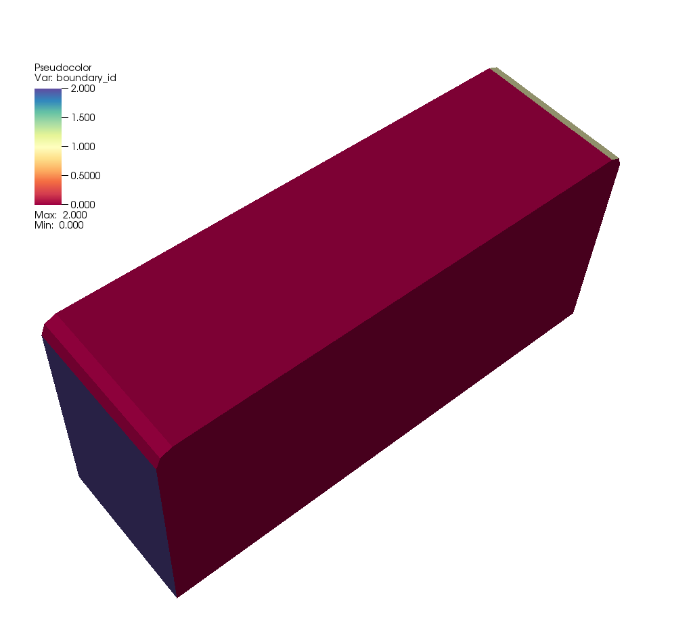

# Table of contents

  * [Overview](#1-overview)
  * [Input](#1-input)
    - [Calling the program](#2-calling-the-program)
    - [The `.prm` file](#2-the-prm-file)
    - [Describing the material properties of the medium](#2-medium)
  * [Output](#1-output)
    - [The file `<outputfileprefix>frequency_response.txt`](#2-txt-file)
    - [The file `<outputfileprefix><freq#>frequency_response.csv`](#2-csv-file)
    - [The file `<outputfileprefix>frequency_response.csv`](#2-csv-file-global)
    - [The file `output.log`](#2-output-log)
    - [Monitoring progress](#2-monitoring)
    - [The directory `<outputfileprefix>visualization/`](#2-viz)
  * [Error reporting](#1-error-reporting)
  * [Terminating execution](#1-terminating)
  * [How this program was tested](#1-testing)
    - [No attenuation](#2-no-attenuation)
        - [Computed port pressures](#3-computed-port-pressures)
        - [Computed port velocities](#3-computed-port-velocities)
        - [Computed point pressures and velocities](#3-computed-point-values)
        - [Switched ports](3-switched-ports)
        - [How these values are shown in the output files](#3-output-files)
        - [How to run these test cases](#3-how-to-test-cases)
    - [With attenuation](#2-with-attenuation)
        - [Point values](#3-attenuation-point-values)
    - [Compute times](#2-run-times)


# Overview <a name="1-overview"></a>

The executable program of this project solves the equations that describe
the acoustic response of a cavity to an applied pressure at one of a
number of ports. It then outputs the average pressure and average
(volumetric) velocity at all ports.

For a given frequency omega, the equations to be solved are the
Helmholtz equations and read
```
  -omega^2 p(x,y,z) - c^2 p(x,y,z) = 0
```
where `c` is the (possibly complex-valued) wave speed and `p` is the
pressure field we seek. The boundary conditions applied to this
equation are
```
  p = 1
```
at a "source port" and
```
  p = 0
```
at all other ports. For the remainder of the boundary, the boundary
conditions applied are
```
  n . nabla p = 0
```

The program solves these equations for a range of frequencies `omega` to compute
a frequency-dependent response of the cavity.

The underlying method used for the solution of the equation is the finite element
method (FEM).


# Input <a name="1-input"></a>

## Calling the program <a name="2-calling-the-program"></a>

The executable (let us assume that it is called `helmholtz.exe`) is
called on the command line in the following way:
```
  helmholtz.exe <instancefolder> <outputfileprefix>
```
where `<instancefolder>` is the name of a directory into which all
output files will be written, and `<outputfileprefix>` is a string
that will be prefixed to output file names so that multiple,
concurrent runs of the same program can avoid overwriting each others'
output files.

If `<outputfileprefix>` is omitted, then the empty string will be used
as a prefix. If `<instancefolder>` is omitted, then the current
directory `"."` will be used for output files.


## The `.prm` file <a name="2-the-prm-file"></a>

All remaining parameters will be read from a file called
`helmholtz.prm` located in the `<instancefolder>` passed on the
command line as described above.

The program reads the parameter values that determine what is to be
computed from this input file.
The syntax of the `helmholtz.prm` file is as follows (the values shown
here on the right hand side of the assignment of course need to be
replaced by values appropriate to a simulation):
```
set Mesh file name                       = ./mesh.msh
set Geometry conversion factor to meters = 0.001

set Material properties file name        = air.txt

set Frequencies                          = list(5000,10000,15000)
set Evaluation points                    = -25,15,1 ; -25,15,2

set Number of mesh refinement steps      = 0
set Finite element polynomial degree     = 2
set Number of threads                    = 1
```
The first of these parameters, obviously, corresponds to the name of a
file that contains the mesh that describes the domain on which to solve the PDE (i.e., the shape
of the cavity). The file may describe either a tetrahedral or a hexahedral mesh -- both are
supported. The ending of the name of the file determines
which format it is to be read in:

  - `.msh` indicates that the file is to be interpreted as a file generated by the gmsh
    program.
  - `.mphtxt` indicates that the file is to be interpreted as a file generated by
    COMSOL multiphysics in its text file format.
  - `.inpt` indicates that the file is to be interpreted as a file generated by
    ABAQUS in its usual mesh file format (but *not* as a "FlatDeck" file).

The second parameter in this block describes a scaling
factor: mesh files generally are drawn up in community-specific units
(millimeters, inches) whereas this program internally works with SI
units (i.e., kilograms, meters, seconds) and the parameter describes
the scaling from length units used in the mesh file to meters. In the
example above, this corresponds to the mesh file using millimeters.

The second block (third parameter) describes where to find the frequency-dependent
mechanical properties of the medium. All parameters are given in SI
units. The detailed format of this file is discussed below.

The third block describes the frequencies that should be
computed. There are three possibilities for this parameter:

  - Specify `linear_spacing(f1,f2,nsteps)`: This computes `nsteps`
    frequencies between `f1` and `f2` (given in Hz) with equal spacing
    between frequencies.
  - Specify `exp_spacing(f1,f2,nsteps)`: This computes `nsteps`
    frequencies between `f1` and `f2` (given in Hz) with equal spacing
    between the logarithms of frequencies. In other words, the gaps
    between successive frequencies grow exponentially: On a log plot,
    the frequencies so computes are equall spaced.
  - Specify `list(f1,f2,f3,...)`: Here, the program computes all of
    the frequencies explicitly listed between parentheses. The list
    may have any length, as long as it contains at least one element.

The second parameter in this block also describes a list of three-dimensional points
(using the same units as the mesh file) at which the pressure and
volumetric velocity will be evaluated for each frequency. Points are
separated by semicolons, and the components of the points are
separated by commas.

The fourth block of parameters shown above describes properties of the
discretization, i.e., of _how_ the problem (formulated as a PDE)
should be solved rather than what the problem actually is. In
particular, the parameters list the number of mesh refinement steps
(each refinement step replaces each cell of the mesh by its four
children) as well as the polynomial degree of the finite element
approximation.

The number of mesh refinement steps is interpreted in the following
way: If it is positive or zero, then the mesh on which the solution is
computed is simply the mesh taken from the file listed in the first
parameter, this many times refined by replacing each cell by its four
children in each refinement step. In particular, this leads to using
the same mesh for all frequencies.

On the other hand, if the number of mesh refinement steps is negative,
then the mesh is adapted using the following algorithm. For a given
wave speed, we can compute the wavelength of oscillations for a
given frequency _w_ via
```
  lambda = c/f
         = c/(w/(2pi))
```
If `lambda` is larger than the diameter of the domain, then we replace
it by the diameter of the domain since that is the largest wavelength
at which the solution can vary.
We can then determine a frequency-adapted mesh size in the following
way: We want that there are at least _N_ grid points per wave
length. Since there are as many grid points per cell as the polynomial
degree _p_, this equations to requiring that the mesh size _Delta x_
satisfies _Delta x / p <= lambda/N_
or equivalently: _Delta x <= lambda/N * p_. The `Mesh refinement steps`
parameter is then interpreted as _N_ if it is negative.

The last parameter, `Number of threads`, indicates how many threads
the program may use at any given time. Threads are used to compute
the frequency response for different frequencies at the same time
since these are independent computations. A value of zero means that
the program may use as many threads as it pleases, whereas a positive
number limits how many threads (and consequently CPU cores) the
program will use.


## Describing the material properties of the medium <a name="2-medium"></a>

The `.prm` file mentioned above makes reference to a file that
contains the frequency-dependent material properties of the
medium. (In the example above, it is called `air.txt`.) This file
needs to have the following format:
```
%frequency(Hz)    density(kg/m3), real/imag          bulk modulus(Pa), real/imag
10                1.7507     -251.40                 112615.491      119.669
60.201            1.7507     -41.763                 112631.842      720.021
110.402           1.7507     -22.776                 112671.498      1318.65
160.603           1.7506     -15.66                  112734.259      1914.15
210.804           1.7505     -11.934                 112819.809      2505.12
261.005           1.7504     -9.6422                 112927.724      3090.22
311.206           1.7502     -8.0903                 113057.471      3668.13
361.407           1.75       -6.97                   113208.422      4237.61
[...]
```
The first line of this file is treated as a comment and
ignored. Following lines provide the frequency at the beginning of each
row of the table, followed by real and imaginary parts of the density and bulk
modulus.

The file as a whole needs to end in a newline.

When asked to compute the response of a cavity at a specific
frequency, the solver linearly interpolates between lines of the
file. For example, at a frequency of 185.7035 Hz, it will use density and
bulk modulus values halfway between the ones tabulated for 160.603 and
210.804 Hz. If the solver is asked for a frequency below the very
first frequency provided in the file, it simply uses the values of the
first value provided. Similarly for a frequency above the last one
provided: It just takes the last provided values. This allows to
specify air in the following way, using only a single line, given that
air has no substantial frequency dependence to its material properties:
```
%         frequency(Hz)        density(kg/m3), real/imag      bulk modulus(Pa), real/imag
          10                   1.205728     0                 142090.344491053     0       
```


# Output <a name="1-output"></a>

The output of the program consists of three pieces:
- the frequency response file in human-readable form
- the frequency response file in machine-readable form
- and a number of files in the visualization directory.

## The file `<outputfileprefix>frequency_response.txt` <a name="2-txt-file"></a>

After each frequency has been computed, the program appends results to
a frequency response file.

The principal piece of interest in this file is the `M` matrix. For a geometry
with `n=3` ports, this matrix is defined by stating that
```
|  m11   m12   m13   m14   m15   m16|   | P1 | = |b1|
|  m21   m22   m23   m24   m25   m26|   | U1 |   |b2|
|  m31   m32   m33   m34   m35   m36|   | P2 |   |b3|
                                        | U2 |
                                        | P3 |
                                        | U3 |
```
where the components `b1`, `b2, `b3` of the right hand side vector correspond
to volumetric source terms and are zero for our current situation. For a general
case of `n` ports, the `M` matrix has size `n` times `2*n`.

In the equation above, `Pi` and `Ui` are the average pressure and normal
velocity at port `i`, where velocities are computed *into* the geometry
and the average is computed by forming the integral of the pressure or
velocity over the area of a port divided by the area of the port.

The way the program computes the `M` matrix is by solving for situations
where one prescribes a unit presure on one port and zero pressure on
all other ports, and then computing the average velocity on all ports. For
example, if one prescribes a unit pressure on port 1, then we know that
```
|  m11   m12   m13   m14   m15   m16|   |  1  | = |0|
|  m21   m22   m23   m24   m25   m26|   | U11 |   |0|
|  m31   m32   m33   m34   m35   m36|   |  0  |   |0|
                                        | U21 |
                                        |  0  |
                                        | U31 |
```
and `U11`, `U12`, and `U13` are known. We can repeat this for all three
ports, and this leads to the linear system
```
|  m11   m12   m13   m14   m15   m16|   |  1   0   0  | = |0 0 0|
|  m21   m22   m23   m24   m25   m26|   | U11 U12 U13 |   |0 0 0|
|  m31   m32   m33   m34   m35   m36|   |  0   1   0  |   |0 0 0|
                                        | U21 U22 U23 |
                                        |  0   0   1  |
                                        | U31 U32 U33 |
```
Here, this means that we have 9 equations for the 18 entries of the matrix `M`.
In general, we will have `n*n` equations for the `n*(2n)` entries of `M`. That
means, we can choose `n*n` entries of `M` at will, and compute the rest from the
equations we have. We will do this by choosing the elements of every other column
of `M` in a convenient way, namely
```
|  m11   -1   m13    0   m15    0|   |  1   0   0  | = |0 0 0|
|  m21    0   m23   -1   m25    0|   | U11 U12 U13 |   |0 0 0|
|  m31    0   m33    0   m35   -1|   |  0   1   0  |   |0 0 0|
                                     | U21 U22 U23 |
                                     |  0   0   1  |
                                     | U31 U32 U33 |
```
as this will then allow us to put all of the terms involving `Uij`
onto the right hand side and we obtain
```
|  m11   m13   m15|   |  1   0   0 | = |U11 U12 U13|
|  m21   m23   m25|   |  0   1   0 |   |U21 U22 U23|
|  m31   m33   m35|   |  0   0   1 |   |U31 U32 U33|
```
This then immediately allows us to read off the entries of the
matrix on the left, and we get that the matrix we seek is of the
form
```
    |  U11   -1   U13    0   U15    0|
M = |  U21    0   U23   -1   U25    0|
    |  U31    0   U33    0   U35   -1|
```
with the obvious generalization to arbitrary numbers of ports.

In addition to this matrix, the `frequency_response.txt` file also contains output
that presents the pressures and velocities at the evaluation points selected in
the input file.

Together the output file will look like this:
```
Results for frequency f=100000:
==============================

M = [
      [           0-0.00186982j             -1            0+0.00280168j              0 ]
      [           0+0.00280168j              0            0-0.00186982j             -1 ]
]


Pressure and velocity at explicitly specified evaluation points:
  Point at [0.001 0.0005 0.0005], source port with boundary id 1:  p=1.14928+0j, u=[0+0.001145j, -0-1.86333e-05j, -0-4.02683e-06j]
  Point at [0.001 0.0005 0.0005], source port with boundary id 2:  p=-0.865903+0j, u=[0+0.00156858j, 0+1.4168e-05j, 0+3.14178e-06j]
```


## The file `<outputfileprefix><freq#>frequency_response.csv` <a name="2-csv-file"></a>

For each frequency computed, the program also generates a separate file with
results in computer-readable, CSV format. In these files, corresponding
1:1 to the human-readable `.txt` file described above, the single line
of information starts with the frequency and then has each of the numbers
shown above in a comma-separate format. This then looks as follows:
```
100000, 0-0.00186982j, -1, 0+0.00280168j, 0, 0+0.00280168j, 0, 0-0.00186982j, -1, 1.14928+0j, 0+0.001145j, -0-1.86333e-05j, -0-4.02683e-06j, -0.865903+0j, 0+0.00156858j, 0+1.4168e-05j, 0+3.14178e-06j, 
```


## The file `<outputfileprefix>frequency_response.csv` <a name="2-csv-file-global"></a>

It is inconvenient to deal with individual `.csv` files for each frequently.
As a consequence, all of the `.csv` files are concatenated into a single file
with name `<outputfileprefix>frequency_response.csv` that contains information
about the responses to all frequencies. Since each of the single-frequency
`.csv` files has just one line, the combined file has one line per frequency.
The first entry in each line (just like in the individual frequency files)
corresponds to the frequency in Hertz this line corresponds to.


## The file `output.log` <a name="2-output-log"></a>

This file contains some status information that chronicles progress of what
the program is doing. It will look similar to the following:
```
INFO Program started with argument '.'
INFO Material parameters file contains data for 200 frequencies ranging from 10 to 10000Hz.
INFO Number of frequencies scheduled: 1
INFO Reading mesh file <../helmholtz/geometries/cylinder-from-dealii/tet.msh> in GMSH .msh format
INFO The mesh has 30720 cells
INFO Found boundary ids 0 1 2 
INFO The mesh has 5561 unknowns
INFO Computing data for omega=628319, source port boundary id=1
INFO Computing data for omega=628319, source port boundary id=2


+---------------------------------------------+------------+------------+
| Total wallclock time elapsed since start    |      2.37s |            |
|                                             |            |            |
| Section                         | no. calls |  wall time | % of total |
+---------------------------------+-----------+------------+------------+
| Assemble linear system          |         2 |     0.092s |       3.9% |
| Creating visual output          |         2 |     0.582s |        25% |
| Make grid                       |         1 |     0.148s |       6.3% |
| Postprocess                     |         2 |    0.0118s |       0.5% |
| Set up system                   |         1 |    0.0187s |      0.79% |
| Solve linear system             |         2 |      1.52s |        64% |
+---------------------------------+-----------+------------+------------+
```
The information in this file is mostly interesting to see what is currently
happening and to obtain some statistics on the mesh being used.


## Monitoring progress <a name="2-monitoring"></a>

The `frequency_response.txt` and `frequency_response.csv` files are
updated every time the program has finished computing the response of
the cavity for a particular frequency. As a consequence, the file
contains a record of all computed frequencies.

To monitor the progress of computations -- for example for displaying
a progress bar -- open the `frequency_response.csv` file periodically
(say, once a second) and read what's in it. If all you want is to show
progress: The first line of the file has a format that, during
computations, says something like "`# 42/100 frequencies computed`",
allowing for a quick overview where computations currently are. If you
want something fancier, you can actually parse the contents of the
file and update a graph of the frequency-dependent cavity response
every time you read through the file. This way, the graph will fill in
over time.

When the program has successfully finished all computations, it
generates a file `<outputfileprefix>success_signal.txt` in the
instance folder, and terminates. If the solver fails for some reason,
it instead generates a file
`<outputfileprefix>solver_failure_signal.txt` in the instance folder.
Both of these files are removed at the beginning of the program run
should they exist.


## The directory `<outputfileprefix>visualization/` <a name="2-viz"></a>

This directory contains one file for each input frequency and source port, with each file providing
all of the information necessary to visualize the solution. The format used for these
files is VTU, and the solution can be visualized with either the
[Visit](https://wci.llnl.gov/simulation/computer-codes/visit) or
[Paraview](https://www.paraview.org/) programs.
The file names are of the form `<outputfileprefix>visualization/solution-XXXXX.YY.vtu` where `XXXXX`
denotes the (integer part of the) frequency (in Hz) at which the solution
is computed, and `YY` is the number of the source port.

For debugging purposes, it is often useful to also see the geometry of
the domain and how different parts of the boundary are labeled by the
boundary indicators that are used to identify "ports". To this end,
the program writes a file
`<outputfileprefix>visualization/surface.vtu` right after reading in
the mesh and before anything else happens -- that is, before much of
anything else can go wrong in the program.

When visualized, the data stored in this file might look like the
following picture for one of the geometries with which this program
was tested:



The image shows how most of the boundary of the geometry is labeled
with boundary indicator zero (which the program interprets as "not a
port"), whereas the left side and a thin strip along the top right
edge are labeled with boundary indicators two and one, respectively
(which the program then interprets as the "ports" of the geometry).


# Error reporting <a name="1-error-reporting"></a>

There are many ways execution of this program can run into errors. The most common are
that something is wrong with the input: The file that is listed as containing the mesh
does not exist, or it may not follow the structure required of this file; the file that
describes the speed of sound does not exist, or it has invalid values (say, negative
wave speeds). But there are also ones that could indicate a bug in the code, or that
the program has run out of resources (say, it can't allocate enough memory).

All of these errors lead to two consequences:

* The program terminates with a non-zero return code.
* The program leaves behind a file called `<instance-folder>/<output-prefix>/solver_failure_signal.txt`.
* The program writes the error message into a file 
  `<instance-folder>/<output-prefix>/error.log`. These error messages look similar to the following one
  that resulted from a mesh input file that did not conform to the specifications:
```
    ERROR Exception while computing for frequency 100000:

    --------------------------------------------------------
    An error occurred in line <2109> of file
    </home/bangerth/p/deal.II/1/dealii/source/grid/grid_in.cc> in function
         void dealii::GridIn<dim, spacedim>::read_msh(std::istream&) [with int dim = 3; int spacedim = 3; std::istream = std::basic_istream<char>]
    The violated condition was:
         cells.size() > 0
    Additional information:
         While reading a gmsh file, the reader function did not find any cells.
         This sometimes happens if the file only contains a surface mesh, but
         not a volume mesh.

         The reader function did find 0 lines and 167936 facets (surface
         triangles or quadrilaterals).
    --------------------------------------------------------
```

# Terminating execution <a name="1-terminating"></a>

There may be times where callers of this program do not want it to continue with
its computations. In this case, an external program should place the text `STOP`
into a file called `<outputfileprefix>termination_signal.txt` in the
instance folder. This will terminate the program. That said, because the program outputs all
data already computed whenever one frequency is finished, even when a
program execution is terminated, already computed information is still
stored in the output files.

The program works on input frequencies in an unpredictable order, since work
for each frequency is scheduled with the operating system at the beginning
of program execution, but it is the operating system's job to allocate CPU
time for each of these tasks. This is often done in an unpredictable order.
As a consequence, the frequencies already worked on at the time of termination
may or may not be those listed first in the input file.


# How this program was tested <a name="1-testing"></a>

## No attenuation <a name="2-no-attenuation"></a>

We can check for the correctness of the program using the following
set up: Let us choose a cylinder along the _x_-axis with length 4
and radius 1. We use a scaling factor of 0.001, so this corresponds to a length
_L_=4mm and radius _r_=1mm. Meshes for this set up are saved in the
`geometries/cylinder-from-dealii/` directory, along with sample input files
discussed below. (The derivations below assume that the cylinder goes
from _x=0_ to _x=L_, but in actual fact the geometry stored in the
mesh files uses a geometry that goes from _x=-L/2_ to _x=L/2_. This
only translates the solution to the left, and the only place where we
have to come back to that is where we evaluate point values.)

The solution to this problem is one-dimensional, and reads
```
  p(x) = a*exp(j*k*x) + b*exp(-j*k*x)
```
with _k=omega/c_ and _a,b_ so that
```
  p(0) = 1
  p(L) = 0
```
if considering the source on the left end of the cylinder. This then implies
```
  a+b=1
  a*exp(j*omega/c*L) + b*exp(-j*omega/c*L)=0
```
Inserting the first of these equations into the second, and multiplying by
`exp(j*omega/c*L)`, we get
```
  (1-b)*exp(2*j*omega/c*L) + b=0
```
which then results in
```
  exp(2*j*omega/c*L) + (1-exp(2*j*omega/c*L))*b=0
```
and consequently
```
  b = -exp(2*j*omega/c*L) / [ 1-exp(2*j*omega/c*L) ]
  a = (1-b)
    = 1+exp(2*j*omega/c*L) / [ 1-exp(2*j*omega/c*L) ]
    = 1 / [ 1-exp(2*j*omega/c*L) ]
```
Taken together, this results in the following solution:
```
  p(x) = exp(j*omega/c*x)/[ 1-exp(2*j*omega/c*L) ]
         - exp(2*j*omega/c*L) * exp(-j*omega/c*x)/[ 1-exp(2*j*omega/c*L) ]
       = [ exp(j*omega/c*x) - exp(j*omega/c*(2L-x)) ]
           / [ 1-exp(2*j*omega/c*L) ]
```
We can easily verify that `p(0)=1` and `p(L)=0`, as expected.

Furthermore, we can compute the (volumetric) velocity as
```
  u(x) = -1/(j rho omega) nabla p
```
of which only the _x_-component is nonzero and reads as
```
  u_x(x) = -1/(rho c) [ exp(j*omega/c*x) + exp(j*omega/c*(2L-x)) ]
           / [ 1-exp(2*j*omega/c*L) ]
```
So, at the left end of the cylinder, we have
```
  u_x(0) = -1/(rho c) [ 1 + exp(2*j*omega/c*L)) ]
           / [ 1-exp(2*j*omega/c*L) ]
```
and at the right end
```
  u_x(L) = -2/(rho c) exp(j*omega/c*L) / [ 1-exp(2*j*omega/c*L) ]
```

We can test all of this for a concrete choice of wave speed `c`,
density `rho`, and frequency `omega = 2*pi*f` using the cylinder
of length `L=4mm` described above. Using the following input file,
```
set Mesh file name                       = ../helmholtz/geometries/cylinder-from-dealii/hex.msh
set Geometry conversion factor to meters = 0.001
set Evaluation points                    = 1,0.5,0.5

set Material properties file name       = ../helmholtz/material-models/air.txt

set Frequencies                          = list(100000)
set Number of mesh refinement steps      = 0
set Finite element polynomial degree     = 1
set Number of threads                    = 1
```
we have need to look up density and bulk modulus at the chosen
frequency `f=100 kHz` in the `air.txt` file. Because this frequency
exceeds the last frequency listed in that file (which is `f=10 kHz`),
we need to read the values from the line in that file, where we find that
`rho=1.205728 kg/m^3` and `kappa=142090.344491053 Pa`. This gives us
`c=343.287 m/s`. At the chosen frequency of 100 kHz, this
produces a wave length of 3.43mm, just short of the length of the
cylinder.


### Computed port pressures <a name="3-computed-port-pressures"></a>

A visualization of the real part of the pressure solution
computed by the program looks as follows, on a hexahedral mesh with
11,121 unknowns:


To verify that this computed solution is, at the very least, not completely
wrong, we can plot the function _p(x)_ computed above (with the material
parameters and _L_ substituted) along with the minimal and maximal
values of the numerical solution shown in the picture above. It looks
as follows:


This comparison shows that at the very least the minimum and maximum
values of the pressure are computed correctly; the general behavior
of the pressure in the cylinder also matches what we see from the
one-dimensional plot of the exact solution _p(x)_.


### Computed port velocities <a name="3-computed-port-velocities"></a>

To compare the velocities, we can also substitute the material parameters
and length of the cylinder into the formula for _u_, and obtain for the
exact values that
```
  u_x(0) = 0-0.00144j
```
and at the right end
```
  u_x(L) = 0-0.00286j
```
where at the right end, the sign needs to be flipped to obtain the
_inward_ velocity. Indeed, on the hexahedral mesh shown above, the program
produces these values for the two ports:
```
  0-0.00173j
  0+0.00280j
```
On a tetrahedral mesh with approximately the same number of unknowns,
the values are
```
  0-0.00187j
  0+0.00280j
```
Both are reasonably good approximations, though maybe not spectacularly
close ones. But that may not be surprising: the mesh is quite coarse.
We can improve the quality of the approximation by using a higher polynomial
degree in the finite element method, by setting
```
set Finite element polynomial degree     = 2
```
In that case, the same hexahedral mesh produces values
```
  0-0.001432j
  0+0.002817j
```
and the tetrahedral mesh
```
  0-0.001436j
  0+0.002822j
```
both of which values are exact to within less than two per cent error. Similar
accuracy can be achieved by simply using a mesh with smaller cells. Both the
finer mesh and the higher polynomial degree of course come with the drawback
of longer compute times.


### Computed point pressures and velocities <a name="3-computed-point-values"></a>

The input file above also asks for pressures and velocities to be computed at
individual points -- here, specifically the point `(1, 0.5, 0.5)`, which is then
converted with the geometry conversion factor to the location `(1mm, 0.5mm, 0.5mm)`.
Taking into account that the actual geometry went from _x=-L/2_ to _x=L/2_,
this point lies three quarters down the length of the cylinder and using the
formulas above, we need to compare what the program computes with what the
formulas say for _x=3/4L_.
Of course, for the current example case, the solution is really one-dimensional,
so the `y` and `z` components of that point do not matter, and we would expect
the pressure and velocity to be
```
  p(x=3mm) = 1.1220+0j
  u(x=3mm) = [0-0.0007197j, 0, 0]
```
where the `y` and `z` components of the velocity are zero.

The program computes and outputs the following values for the
tetrahedral mesh:
```
Pressure and velocity at explicitly specified evaluation points:
  Point at [0.001 0.0005 0.0005], source port with boundary id 1: \
      p=1.14928+0j, u=[0+0.001145j, -0-1.86333e-05j, -0-4.02683e-06j]
```
And the following for the hexahedral mesh:
```
Pressure and velocity at explicitly specified evaluation points:
  Point at [0.001 0.0005 0.0005], source port with boundary id 1: \
      p=1.13396+0j, u=[0+0.000397294j, 0+3.60157e-18j, -0-9.60419e-18j]
```

The computed pressure is clearly a good approximation of the exact value. The
velocity is further from the exact value -- a well-understood phenomenon when
trying to compute derivatives of the solution at individual points using
linear finite elements. The approximation can be improved by selecting
quadratic (polynomial degree 2) finite elements. The results then obtained
are as follows for the tetrahedral mesh:
```
  Point at [0.001 0.0005 0.0005], source port with boundary id 1: \
      p=1.12215+0j, u=[0+0.000729637j, -0-3.12669e-06j, -0-1.04111e-06j]
```
And as follows for the hexahedral mesh:
```
  Point at [0.001 0.0005 0.0005], source port with boundary id 1: \
      p=1.12204+0j, u=[0+0.000721733j, 0+1.77855e-18j, -0-4.53434e-17j]
```
Both of these results are now very close to the exact value.


### Switched ports <a name="3-switched-ports"></a>

The results above were shown where the port with boundary id 1 is the "source"
(i.e., has a prescribed pressure of one) and the port with boundary id 2
is one of the other ports (where the prescribed pressure is zero).

Of course, we are also interested in what happens when we switch the source
and receiver ports. We can consider this case by again starting from the
general solution
```
  p(x) = a*exp(j*k*x) + b*exp(-j*k*x)
```
with _k=omega/c_, but now we need to choose _a,b_ so that
```
  p(0) = 0
  p(L) = 1
```
This now implies
```
  a+b=0
  a*exp(j*k*L) + b*exp(-j*k*L)=1
```
Inserting the first of these equations into the second, we get
```
  -b * [ exp(j*k*L) - exp(-j*k*L) ] = 1
```
which we can express as
```
  b = -1 / [ exp(j*k*L) - exp(-j*k*L) ]
```
amd consequently the solution is
```
  p(x) =  a*exp(j*k*x) + b*exp(-j*k*x)
       = -b*exp(j*k*x) + b*exp(-j*k*x)
       = -b * [ exp(j*k*x) - exp(-j*k*x) ]
       = [ exp(j*k*x) - exp(-j*k*x) ] / [ exp(j*k*L) - exp(-j*k*L) ]
```
for which it is easy to verify that indeed _p(0)=0_ and _p(L)=1_
as desired.

As before, we are interested in the velocity,
```
  u(x) = -1/(j rho omega) nabla p
```
of which only the _x_-component is nonzero and reads as
```
  u_x(x) = -1/(rho c) [ exp(j*k*x) + exp(-j*k*x) ]
                    / [ exp(j*k*L) - exp(-j*k*L) ]
```
So, at the left end of the cylinder, we have
```
  u_x(0) = -2/(rho c) / [ exp(j*k*L) - exp(-j*k*L) ]
```
and at the right end
```
  u_x(L) = -1/(rho c) [ exp(j*k*L) + exp(-j*k*L) ]
                    / [ exp(j*k*L) - exp(-j*k*L) ]
```
Inserting concrete values for _c_ and _k=omega/c_, we find that
```
  u_x(0) = 0+0.00280471j
  u_x(L) = 0+0.00142459j
```
That is, up to the sign, the same but switched values as for the
original port assignment. This is not surprising: The geometry and
the location of ports is symmetric, so the solution should also be
symmetric.

Indeed, this is also what the program computes. For the tetrahedral
mesh, we obtain values
```
  0+0.00280j
  0-0.00187j
```
where the flipped sign just reflects the fact that at the right end
the normal vector points _inward_, as opposed to the positive _x_
direction.


### How these values are shown in the output files <a name="3-output-files"></a>

The computations above all show results where the source is at the first port
(i.e., where we apply _p=1_) with all other ports considered outputs (i.e.,
where we set _p=0_). The program repeats all of these computations
with switched roles of input/output ports or, more generally: It cycles through
all ports as source. As discussed in the section on output files above,
the final set of results is encoded in the `M` matrix mentioned above. For example,
for the tetrahedral mesh with polynomial degree one, the human-readable
output file contains this information:
```
Results for frequency f=100000:
==============================

M = [
      [           0-0.00186982j             -1            0+0.00280168j              0 ]
      [           0+0.00280168j              0            0-0.00186982j             -1 ]
]


Pressure and velocity at explicitly specified evaluation points:
  Point at [0.001 0.0005 0.0005], source port with boundary id 1:  p=1.14928+0j, u=[0+0.001145j, -0-1.86333e-05j, -0-4.02683e-06j]
  Point at [0.001 0.0005 0.0005], source port with boundary id 2:  p=-0.865903+0j, u=[0+0.00156858j, 0+1.4168e-05j, 0+3.14178e-06j]
ts/helmholtz-build> cat _0_frequency_response.csv 
100000, 0-0.00186982j, -1, 0+0.00280168j, 0, 0+0.00280168j, 0, 0-0.00186982j, -1, 1.14928+0j, 0+0.001145j, -0-1.86333e-05j, -0-4.02683e-06j, -0.865903+0j, 0+0.00156858j, 0+1.4168e-05j, 0+3.14178e-06j, 
```
Here, each pair of columns of the matrix _M_ corresponds to a source port, with rows
corresponding to evaluating at all ports.

All of this is of course also provided in tabular form in the machine-readable `.csv`
output file, see above.


### How to run these test cases <a name="3-how-to-test-cases"></a>

The input files for the four cases (tetrahedral and hexahedral meshes,
polynomial degree one and two) along with the output files produced
by the programs can all be found in the `geometries/cylinder-from-dealii/`
directory.


## With attenuation <a name="2-with-attenuation"></a>

The results above were obtained with a purely real wave speed (loss
angle zero, no attenuation). This corresponded to selecting the
material parameters of air:
```
set Material properties file name       = ../helmholtz/material-models/air.txt
```
But we can also choose values that correspond to a porous medium
that is lossy:
```
set Material properties file name       = ../helmholtz/material-models/porous.txt
```
Reading material parameters for 100 kHz from this file tells us that
`rho=(1.5845-0.3942j) kg/m^3` and `kappa=(141946.684+11608.3j) Pa`, and
consequently `c=(291.437+47.84j) m/s`
With these values, we then get the following expected (exact) values:
```
  u_x(0) = 0.001919+0.0003758j
```
and at the right end
```
  u_x(L) = -0.0004017-0.0009304j
```
where again we have to flip the sign for the second case to obtain the
_inward_ velocity.
On the tetrahedral mesh, the values computed by the program for the
inward volumetric velocities are
```
  0.00181 +1.61e-05j
  0.000345+0.000942j
```
and for the hexahedral mesh we get
```
  0.00186 +0.000105j
  0.000375+0.000936j
```
which is again a decent, though not spectacularly good, approximation.
As before, the quality of the approximation can be improved by using
a higher polynomial degree or a finer mesh. For polynomial degree
two and tetrahedra, we get
```
  0.00193 +0.000371j
  0.000407+0.000937j
```
whereas with a hexahedral mesh we have
```
  0.00193 +0.000373j
  0.000406+0.000935j
```
both of which are again very close to the exact values.


### Point values <a name="3-attenuation-point-values"></a>

In the same spirit, the point values at the point `(1,0.5,0.5)` (to be scaled
by the geometry scaling factor and corresponding to _x=3mm_ as explained above)
result in exact values of
```
  p(x=3mm) = 0.435632-0.133640j
  u(x=3mm) = [0.000497252+0.0003753412j, 0, 0]
```
The program evaluates these point values to
```
  p = 0.450-0.119j
  u = [0.000519+0.000559j, 0, 0]
```
when using the tetrahedral mesh, and to
```
  p = 0.442-0.127j,
  u = [0.000437+0.000264j, 0, 0]
```
when using the hexahedral meshes. Again, we can improve the accuracy by selecting
quadratic finite elements (polynomial degree 2) for the tetrahedral mesh:
```
  p = 0.436-0.134j,
  u = [0.0005050.000379j, 0, 0]
```
And for the hexahedral mesh:
```
  p = 0.435-0.134j,
  u = [0.000500+0.000376j, 0, 0]
```


## Compute times <a name="2-run-times"></a>

For the cases above, run times on a laptop for a single frequency are approximately as follows:

 - Tetrahedal mesh, polynomial degree 1 (30,720 cells, 5,561 unknowns): 0m02s
 - Hexahedral mesh, polynomial degree 1 (10,240 cells, 11,121 unknowns): 0m11s
 - Tetrahedal mesh, polynomial degree 2 (30,720 cells, 42,673 unknowns):  2m30s
 - Hexahedral mesh, polynomial degree 2 (10,240 cells, 85,345 unknowns): 11m00s

This behavior can roughly be described as
```
  runtime = 1e-7 seconds  *  unknowns**2.
```
This is in line with theoretical predictions of run time as being quadratic
in the number of unknowns. In practice, run times will of course be different
on other systems, but the order of magnitude can be predicted from this sort
of relationship.
